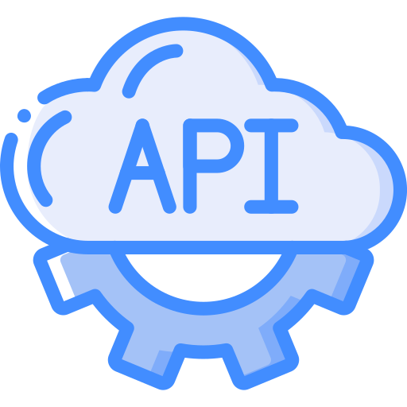
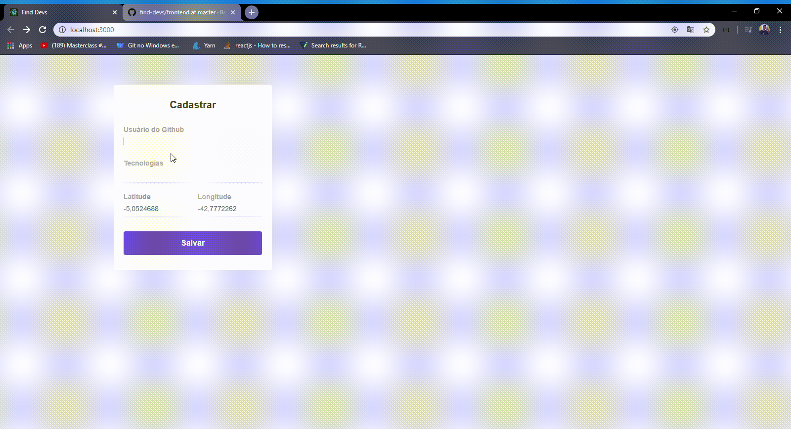

<h1 align="center">
    
</h1>

<h3 align="center">
    "Find Dev", application made in week OmniStack 10, 
    use technologies and geolocation to find some developers like you :).
</h3>

# Usage

To use this app you need have, [Node.js](https://nodejs.org/en/) installed and/or [Yarn](https://yarnpkg.com/lang/en/) installed.

# 💾 "Backend"

<h1 align="center">
    
</h1>

Backend has made in Node.Js, using [MongoDb](https://www.mongodb.com/) as your batabase.

To database aplication you need have, [MongoDb](https://www.mongodb.com/) installed.

### ⚡️ Start

To init backend, run:

```bash
$ cd backend
$ yarn install
$ yarn dev
```

or using npm :

```bash
$ cd backend
$ npm install
$ npm dev
```

Use the [this host](http://localhost:3001) to access the api routes.

# 💻 "Frontend"

<h1 align="center">
    
</h1>

Frontend has made in [React Js](https://pt-br.reactjs.org/), a lib powered by [Facebook](https://developers.facebook.com/?locale=pt_BR).

### ⚡️ Start

To init frontend, run:

```bash
$ cd frontend
$ yarn install
$ yarn start
```

or using npm :

```bash
$ cd frontend
$ npm install
$ npm start
```

<h1 align="center">
    
</h1

Use the [this host](http://localhost:3000) to testing aplication web.
