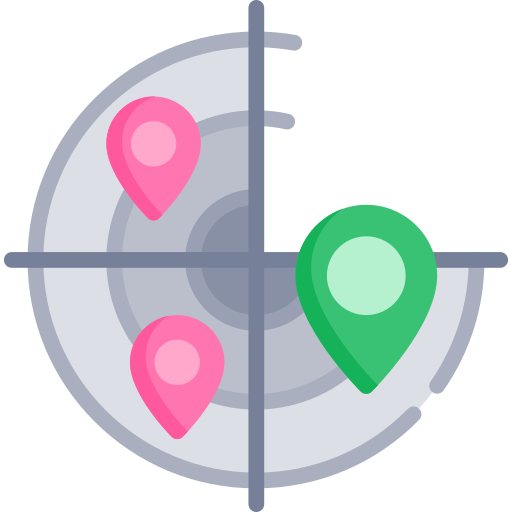

<h1 align="center">
    
</h1>

<h3 align="center">
    "Find Dev", application made in omniStack 10 week, 
    use technologies and geolocation to find some developers like you :)
</h3>

## 💾 Backend

Backend has made in Node.Js, using [MongoDb](https://www.mongodb.com/) as your batabase.

### Usage

To use this API you need have, [Node.js](https://nodejs.org/en/) installed and/or [Yarn](https://yarnpkg.com/lang/en/) installed.

To database aplication you need have, [MongoDb](https://www.mongodb.com/) installed.

### ⚡️ Start

To init backend, run:

```bash
$ cd backend
$ yarn install
$ yarn dev
```

Use the [this host](http://localhost:3001) to access the api routes.
